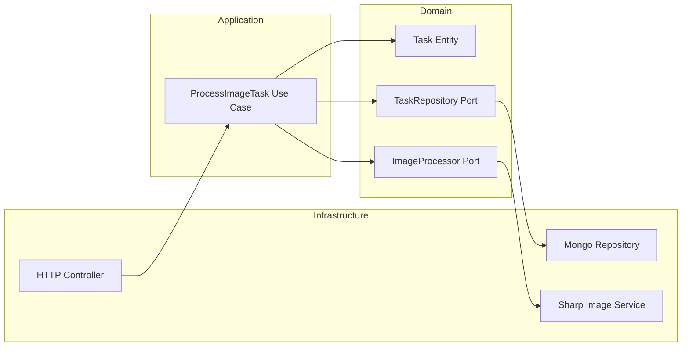

# Hex Images API (NestJS + Hexagonal Architecture)

A REST API for processing images and managing tasks with pricing.
Built using **NestJS** and **Hexagonal Architecture**, this service handles image uploads (local or remote), generates resized variants, and stores metadata in **MongoDB**.

---

## Features
- **Clean architecture**: Domain, Application, Infrastructure layers.
- **MongoDB** with indexing and data integrity.
- **Sharp** for image resizing (1024px and 800px), maintaining aspect ratio.
- **Swagger API Documentation** available at `/docs`.
- **Full test coverage**: Unit and integration tests with `mongodb-memory-server`.


## Getting Started
1. Install and Run
```
npm install
docker compose up -d mongo
npm run start:dev
```

2. Test the API

The API can be tested using Swagger, it can be found in http://localhost:<PORT>/docs


3. Running Tests

npm test          # All tests
npm run test:unit # Unit tests
npm run test:e2e  # Integration tests

## Architecture Overview
```
src/
 ├─ domain/         # Entities and domain interfaces (ports)
 ├─ application/    # Use cases and orchestrator services
 ├─ infrastructure/ # HTTP controllers, MongoDB repositories, schemas, runtime config
 └─ common/         # Shared DTOs, utilities, and error filters
```

## Hexagonal Architecture Diagram

